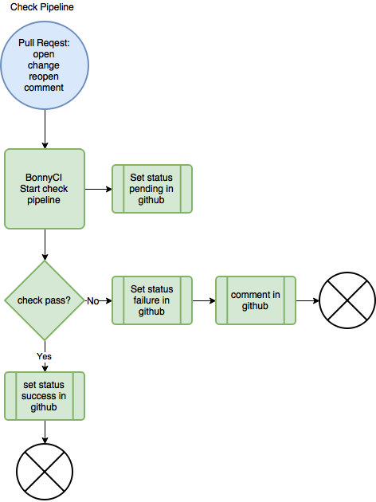
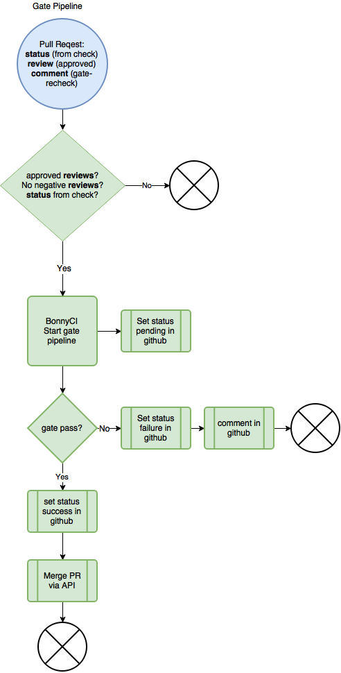

This page is a statement of how things will be, not how things currently are. This design document is used to further work on our project until we can meet the desired design. Content in bold designates work yet to be done.

# Check
A check pipeline runs tests on a newly opened or modified pull request. GitHub will send a web hook upon PR creation or modification. Zuul reacts to these hooks by way of a trigger, and a pipeline can be configured to react to such a trigger.

A check pipeline is an [independent](http://docs.openstack.org/infra/zuul/zuul.html#pipelines) pipeline. Zuul tests the change as presented independent of any other proposed changes. The check pipeline sets a commit [status](https://developer.github.com/v3/repos/statuses/) in GitHub on the commit that is the tip of the PR. The status has a context and state. The context is the name of the Zuul pipeline, for example `check_github`. The state is one of `pending`, `failure`, or `success`. When the pipeline starts, Zuul sets the state of `pending`.

If the jobs pass, Zuul sets the status state of `success`. If any of the jobs fail, Zuul uses the status state of `failure`. Zuul includes a URL link to logs from the pipeline jobs with the status.

**If jobs do not succeed, Zuul comments on the pull request in github, indicating the failure.**

## Check triggers
Triggers are via web hooks sent from github. Zuul responds to the following web hook events as triggers:
* `pr-open`
* `pr-change`
* `pr-reopen`
* `pr-comment` with a comment value of `recheck`

# Gate
A gate pipeline is a [dependent](http://docs.openstack.org/infra/zuul/zuul.html#pipelines) pipeline which creates a queue of chnages. Each change is tested as if all previous changes in the queue are merged. GitHub web hook events potentially trigger the Gate pipline. The Gate pipeline will not trigger unless all pipeline requirements are met. A gate pipeline will execute a series of tests which may or may not be the same tests as the check pipeline.

**A gate pipeline has requirements. For GitHub, we require that a change has passed the check pipeline, and a human with write access to the repository has approved the change for merging. We also require that no other humans with write access have requested changes.**

When the jobs attached to the pipeline start, a status with a context matching the pipeline name is set in github to the `pending` state.

When the jobs attached to the pipeline pass, a status with the context matching the pipeline name is set in github to the `success` state, and the change is merged via the GitHub API.

If the jobs attached to the pipeline fail, a status will be set to the state `failure`.

**On failure, Zuul also comments on the pull request indicating the failure.**

## Gate triggers
Triggers are via web hooks sent from github. Zuul responds to the following web hook events as gate triggers:
* **`status` from BonnyCI check pipeline on HEAD of PR with a state of `success`**
* **`pull_request_review` with an event of `approve`**
* `pr-comment` with a comment value of `gate-recheck`

## Gate requirements
Zuul will not trigger the gate pipeline unless the pull request has the approrpiate states:
* **[reviews](https://developer.github.com/v3/pulls/reviews/#list-reviews-on-a-pull-request) with state of `approve` from at at least one user with write access.**
* **[reviews](https://developer.github.com/v3/pulls/reviews/#list-reviews-on-a-pull-request) absence of any reviews with state `REQUEST_CHANGES` from users with write access**
* **`status` from BonnyCI check pipeline on HEAD of PR with a state of `success`**

